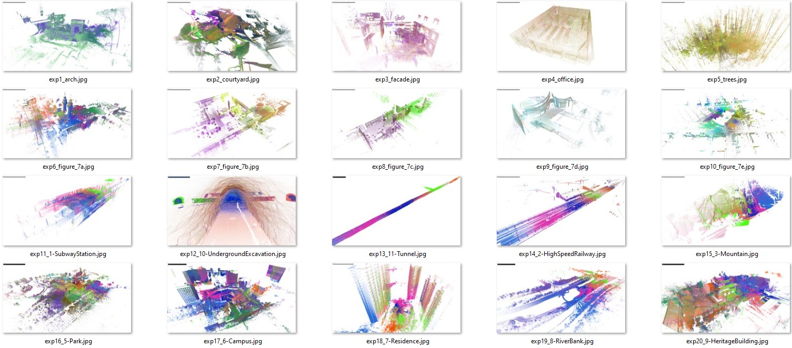

# Open source, open hardware hand-held mobile mapping system for large scale surveys.

This is an open-source software for large-scale 3D mapping using an open-hardware hand-held measurement device available at https://github.com/JanuszBedkowski/mandeye_controller.
- https://www.sciencedirect.com/science/article/pii/S235271102300314X
- If You are ROS user please visit https://github.com/MapsHD/mandeye_to_bag to convert MANDEYE data to ROSBAG
- Sample data is available at https://github.com/MapsHD/OmniWarsawDataset 
- ROSCON 2024 workshop (sample data sets and more ...): https://michalpelka.github.io/RosCon2024_workshop/
- Contact email: januszbedkowski@gmail.com
- VIDEO (how to build mobile mapping hardware) https://www.youtube.com/watch?v=BXBbuSJMFEo
- You can use it for multi view Terrestrial Laser Scanner Registration (Faro, Leica, Z+F, Riegl, etc...) https://www.sciencedirect.com/science/article/abs/pii/S0263224123007637

# Knowledge base (accuracy, precision, benchmarks, comparison to other mobile mapping systems etc...) 
- https://www.mdpi.com/1424-8220/24/18/6010
- https://isprs-archives.copernicus.org/articles/XLVIII-2-W8-2024/147/2024/isprs-archives-XLVIII-2-W8-2024-147-2024.pdf
- https://isprs-archives.copernicus.org/articles/XLVIII-2-W8-2024/9/2024/isprs-archives-XLVIII-2-W8-2024-9-2024.pdf
- https://isprs-archives.copernicus.org/articles/XLVIII-2-W8-2024/25/2024/isprs-archives-XLVIII-2-W8-2024-25-2024.pdf
- https://repozitorij.geof.unizg.hr/islandora/object/geof%3A142/datastream/PDF/view
- https://www.sciencedirect.com/science/article/abs/pii/S0263224123007637
- https://www.ctro.hr/userfiles/files/Affordable%20geo-localisation%20in%20GNSS%20denied%20environment%2C%20Janusz%20B%C4%99dkowski.pdf
- https://www.ibles.pl/wp-content/uploads/2024/06/Torana-Arya.pdf

# To cite this work please use as follows:
Mobile mapping system: hardware and software is elaborated in following paper:
```
@article{BEDKOWSKI2024101618,
title = {Open source, open hardware hand-held mobile mapping system for large scale surveys},
journal = {SoftwareX},
volume = {25},
pages = {101618},
year = {2024},
issn = {2352-7110},
doi = {https://doi.org/10.1016/j.softx.2023.101618},
url = {https://www.sciencedirect.com/science/article/pii/S235271102300314X},
author = {Janusz Będkowski},
keywords = {A mobile mapping, Lidar odometry, Loop closure, Iterative closest point, Data registration, SLAM},
abstract = {This paper presents open-source software for large-scale 3D mapping using an open-hardware hand-held measurement device. This work is dedicated to educational and research purposes. This software is composed of three components: LIDAR odometry, single-session refinement and multi-session refinement. Data refinement uses a pose-graph loop closure technique and an Iterative Closest Point algorithm to minimize the error of the edge. The results are 3D point clouds in LAZ data format (compressed LAS - LIDAR Aerial Survey). It was tested in many real-world scenarios/applications: city-level 3D mapping, culture heritage, creating ground truth data for mobile robots, precise forestry, and large-scale indoor 3D mapping. This software can run on Linux and Windows machines, it does not incorporate GPU computing. It is advised to use at least 32 GB of RAM to cope with large data sets. The optimization framework is implemented from scratch using the Eigen library, thus there is not need to install any additional libraries such as Ceres, g2o, GTSAM, manif, Sophus etc.}
}
```

Terrestrial Laser Scanner data registration is elaborated in following paper:
```
@article{BEDKOWSKI2023113199,
     title = {Benchmark of multi-view Terrestrial Laser Scanning Point Cloud data registration algorithms},
     journal = {Measurement},
     pages = {113199},
     year = {2023},
     issn = {0263-2241},
     doi = {https://doi.org/10.1016/j.measurement.2023.113199},
     url = {https://www.sciencedirect.com/science/article/pii/S0263224123007637},
     author = {Janusz Będkowski},
     keywords = {TLS, Point cloud, Open-source, Multi-view data registration, LiDAR data metrics, Robust loss function, Tait-bryan angles, Quaternions, Rodrigues’ formula, Lie algebra, Rotation matrix parameterization},
     abstract = {This study addresses multi-view Terrestrial Laser Scanning Point Cloud data registration methods. Multiple rigid point cloud data registration is mandatory for aligning all scans into a common reference frame and it is still considered a challenge looking from a large-scale surveys point of view. The goal of this work is to support the development of cutting-edge registration methods in geoscience and mobile robotics domains. This work evaluates 3 data sets of total 20 scenes available in the literature. This paper provides a novel open-source framework for multi-view Terrestrial Laser Scanning Point Cloud data registration benchmarks. The goal was to verify experimentally which registration variant can improve the open-source data looking from the quantitative and qualitative points of view. In particular, the following scanners provided measurement data: Z+F TLS Imager 5006i, Z+F TLS Imager 5010C, Leica ScanStation C5, Leica ScanStation C10, Leica P40 and Riegl VZ-400. The benchmark shows an impact of the metric e.g. point to point, point to projection onto a plane, plane to plane etc..., rotation matrix parameterization (Tait-Bryan, quaternion, Rodrigues) and other implementation variations (e.g. multi-view Normal Distributions Transform, Pose Graph SLAM approach) onto the multi-view data registration accuracy and performance. An open-source project is created and it can be used for improving existing data sets reported in the literature, it is the added value of the presented research. The combination of metrics, rotation matrix parameterization and optimization algorithms creates hundreds of possible approaches. It is shown that chosen metric is a dominant factor in data registration. The rotation parameterization and other degrees of freedom of proposed variants are rather negligible compared with chosen metric. Most of the proposed approaches improve registered reference data provided by other researchers. Only for 2 from 20 scenes it was not possible to provide significant improvement. The largest improvements are evident for large-scale scenes. The project is available and maintained at https://github.com/MapsHD/HDMapping.}
}
```

# VIDEOs
- https://www.youtube.com/watch?v=u8siB0KLFLc&t=435s (data recorded with Mandeye, online data registration with FAST-LIO)

# Compatible commertial products (announcement soon ...)


# Building commands
```
git clone https://github.com/MapsHD/HDMapping.git
cd HDMapping
mkdir build
git submodule init
git submodule update --recursive
cd build
cmake -DCMAKE_BUILD_TYPE=Release ..
make -j
```

# Building Debian package.

The standard build contains all necessary libraries compiled with project. 
This approach allows smooth build on Windows platform and guarantee predictable experience.
If you want to build Debian package, you can depends on system-provided libraries:
Before build install 3rd party libraries:
```
sudo apt-get install freeglut3-dev libeigen3-dev liblaszip-dev
```
Next build Debian package:
```
cmake .. -DBUILD_WITH_BUNDLED_FREEGLUT=0 -DBUILD_WITH_BUNDLED_EIGEN=0 -DBUILD_WITH_BUNDLED_LIBLASZIP=0 -DCMAKE_BUILD_TYPE=Release 
make -j16
make pack
```
To install package :
```
sudo dpkg -i hd_mapping-0.*.*-Linux.deb 
```


Mobile mapping systems is based on LiVOX MID360 - laser scanner with non repetetive scanning pattern.
Specification is available at https://www.livoxtech.com/mid-360/specs. Important parameters:
- weight: less than 1kg,
- battery life: up to 5 hours,
- suggested speed during data acquisition: walking speed (4km/h),
- LiDAR type: Livox MID360,
- LiDAR non-repetitive scanning pattern,
- LiDAR range 40m @ 10\% reflectivity, 70 m @ 80\% reflectivity,
- Range Precision (1 $\sigma$): up to 2cm (@ 10m),
- Integrated IMU (Inertial Measurement Unit).

This work is dedicated to educational and research purposes.
Core of the software is composed of three components: 

- LiDAR odometry,
- single-session refinement,
- multi-session refinement,
- georeferencing.

Data refinement uses a pose-graph loop closure technique and an Iterative Closest Point algorithm to minimize the error of the edge. 
The results are 3D point clouds in LAZ data format (compressed LAS - LIDAR Aerial Survey).
It was tested in many real-world scenarios/applications: city-level 3D mapping, culture heritage, creating ground truth data for mobile robots, precise forestry, and large-scale indoor 3D mapping.
This software can run on Linux and Windows machines, it does not incorporate GPU computing.
It is advised to use at least 32 GB of RAM to cope with large data sets.
The optimization framework is implemented from scratch https://github.com/JanuszBedkowski/observation_equations using the Eigen library, thus there is not need to install any additional libraries such as Ceres, g2o, GTSAM, manif, Sophus etc. 
More information can be found in:

```
@book{DBLP:series/cir/Bedkowski22,
  author       = {Janusz Bedkowski},
  title        = {Large-Scale Simultaneous Localization and Mapping},
  series       = {Cognitive Intelligence and Robotics},
  publisher    = {Springer},
  year         = {2022},
  url          = {https://doi.org/10.1007/978-981-19-1972-5},
  doi          = {10.1007/978-981-19-1972-5},
  isbn         = {978-981-19-1971-8},
  timestamp    = {Mon, 25 Jul 2022 08:41:19 +0200},
  biburl       = {https://dblp.org/rec/series/cir/Bedkowski22.bib},
  bibsource    = {dblp computer science bibliography, https://dblp.org}
}
```

Possible applications:
- culture heritage
- environmental management
- geology
- urban search and rescue
- urban mapping
- ground truth for AGV (Automated Guided Vehicle)
- mobile robot navigation
- precision forestry
- agricultural robotics
- underground mining
- education
- entertainment
- forensics
- critical infrastructure inspection
- space exploration
- protection systems
- digital twin content generation 
- automation in construction
- etc...


City level survey (perspective view).

City level survey (top view).


3D data from aerial LiDAR mapping. 

Aerial LiDAR fused with ground MANDEYE data (fixed issue with missing elevations).


Construction site.

Construction site augmented with MANDEYE 3D data.

Construction progress monitoring, scale blue - smallest changes, red - largest changes.


Tested on following datasets:



Figure: Three publicly available data sets are incorporated into the benchmark.

First row: **ETH**, second row: **RESSO**, third and fourth rows: **WHU_TLS**.

```
ETH:
@article{THEILER2014149,
     title = {Keypoint-based 4-Points Congruent Sets – Automated marker-less registration of laser scans},
     author = {Pascal Willy Theiler and Jan Dirk Wegner and Konrad Schindler},
     journal = {ISPRS Journal of Photogrammetry and Remote Sensing},
     volume = {96},
     pages = {149-163},
     year = {2014},
     issn = {0924-2716},
     doi = {https://doi.org/10.1016/j.isprsjprs.2014.06.015},
     url = {https://www.sciencedirect.com/science/article/pii/S0924271614001701}
}

RESSO:
@article{chen2017plade,    
     title = {PLADE: A Plane-based Descriptor for Point Cloud Registration with Small Overlap},    
     author = {Chen, Songlin and Nan, Liangliang and Xia, Renbo and Zhao, Jibin and Wonka, Peter},    
     booktitle = {IEEE Transactions on Geoscience and Remote Sensing}, 
     volume={58},
     number={4},
     pages={2530-2540},     
     year = {2020} 
}

WHU_TLS:
@article{DONG2020327,
     title = {Registration of large-scale terrestrial laser scanner point clouds: A review and benchmark},
     author = {Zhen Dong and Fuxun Liang and Bisheng Yang and Yusheng Xu and Yufu Zang and Jianping Li and Yuan Wang and Wenxia Dai and Hongchao Fan and Juha Hyyppä and Uwe Stilla},
     journal = {ISPRS Journal of Photogrammetry and Remote Sensing},
     volume = {163},
     pages = {327-342},
     year = {2020},
     issn = {0924-2716},
     doi = {https://doi.org/10.1016/j.isprsjprs.2020.03.013},
     url = {https://www.sciencedirect.com/science/article/pii/S0924271620300836}
}
```


