# Download app

Download *.exe and laszip3.dll from [Releases](https://github.com/MapsHD/HDMapping/releases)

# Running the app

Step 1: Load RESSO file reported by [1] as ground truth

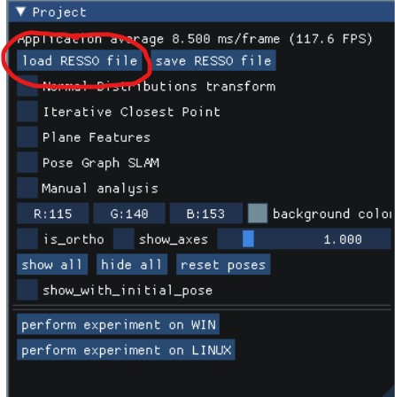

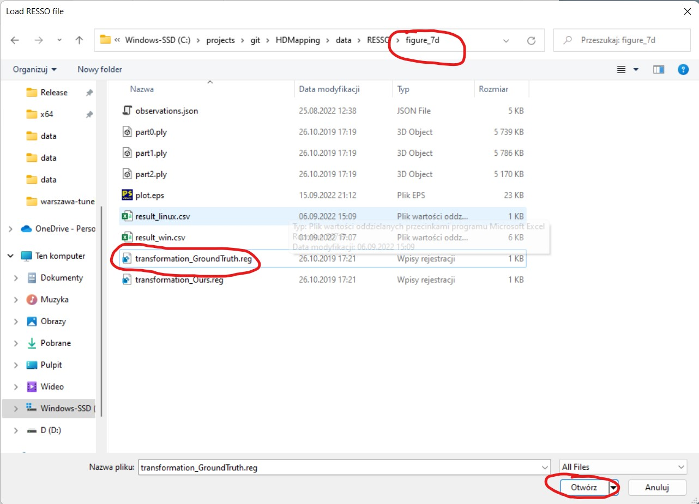

Step 2: Choose manual analisys and load observations

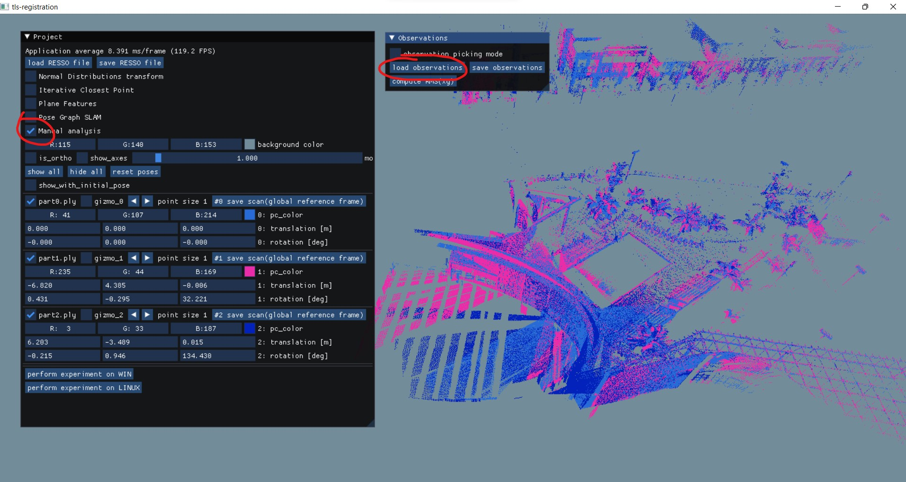

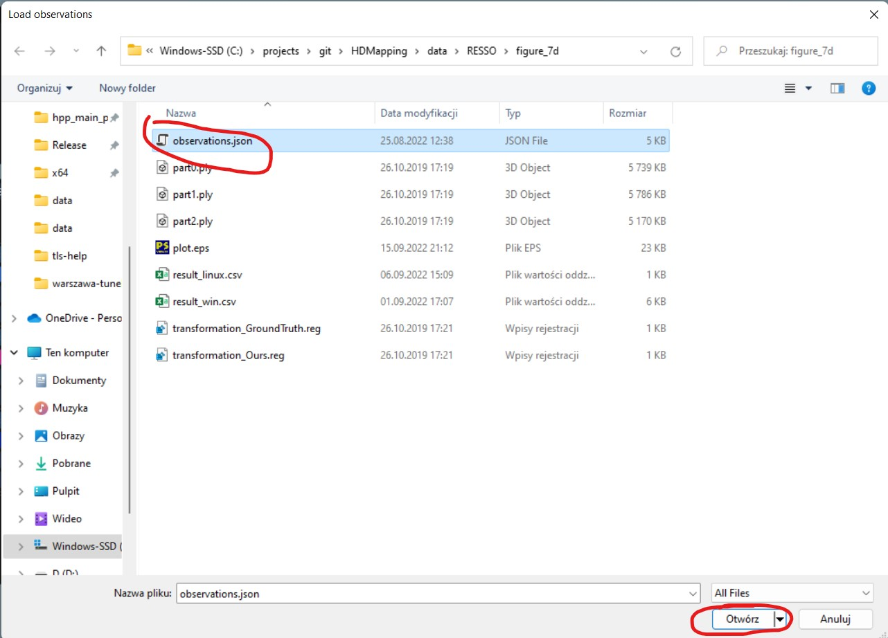

Step 3: Choose observation picking mode and compute RMS

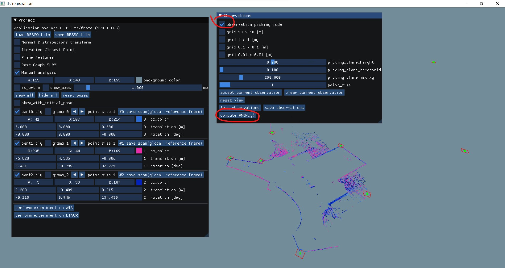

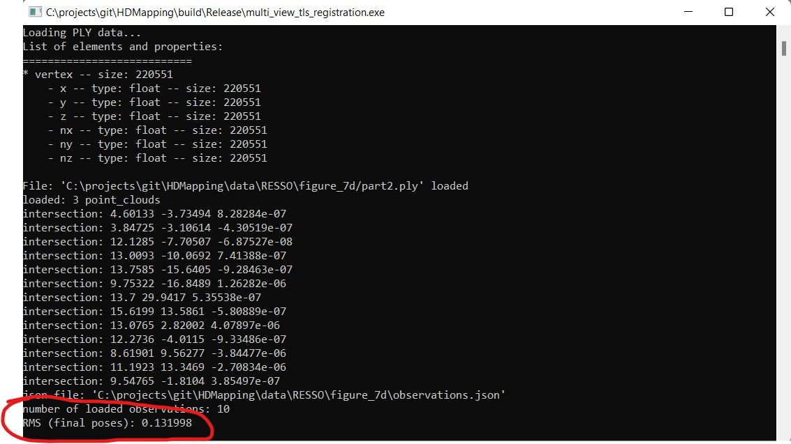

Step 4: Choose one from plenty of optimization variants 

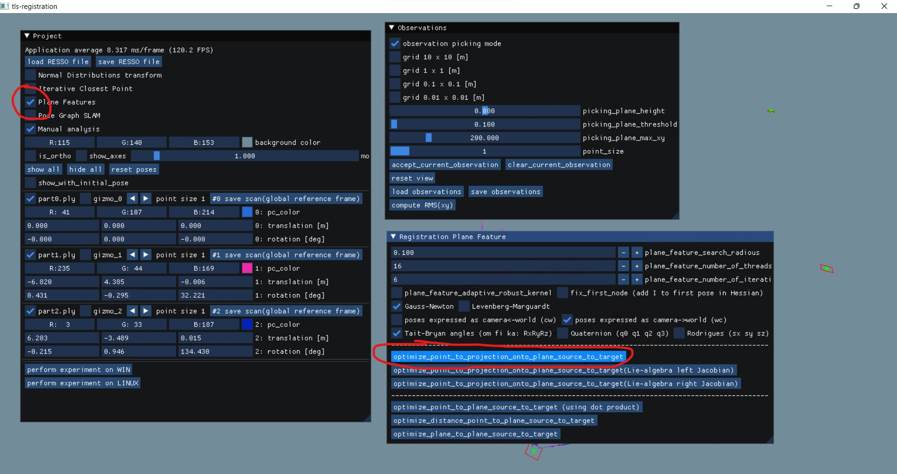

Step 5: Check results before (initial pose) and after optimization

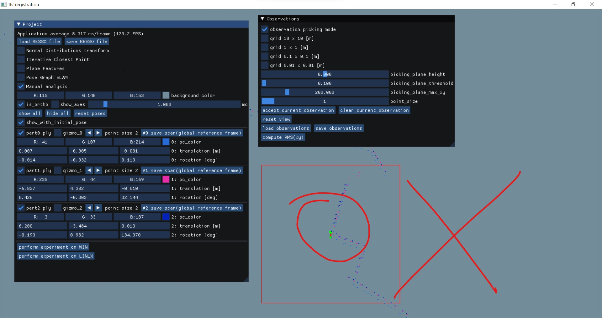

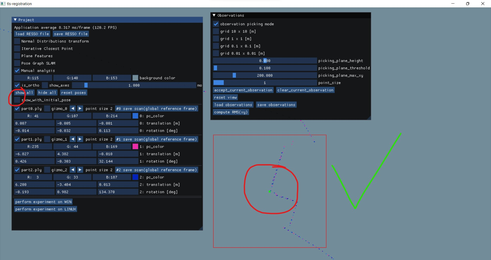

Step 6: Compute RMS

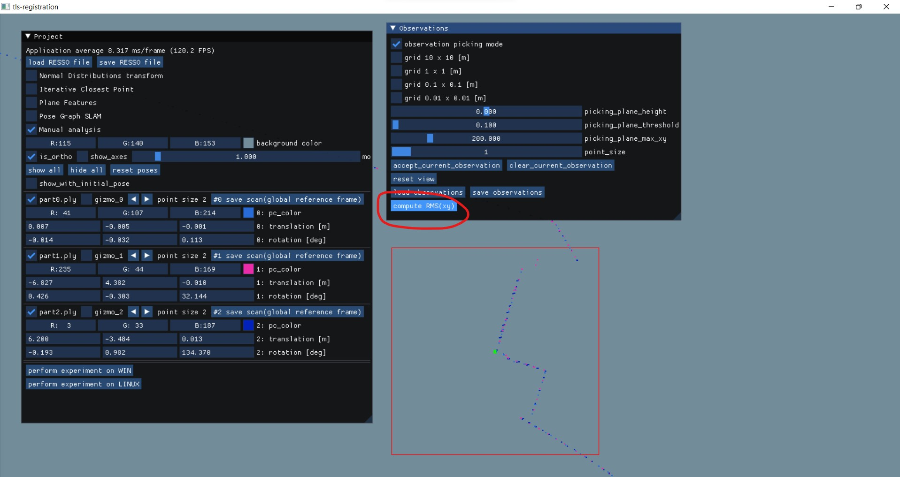

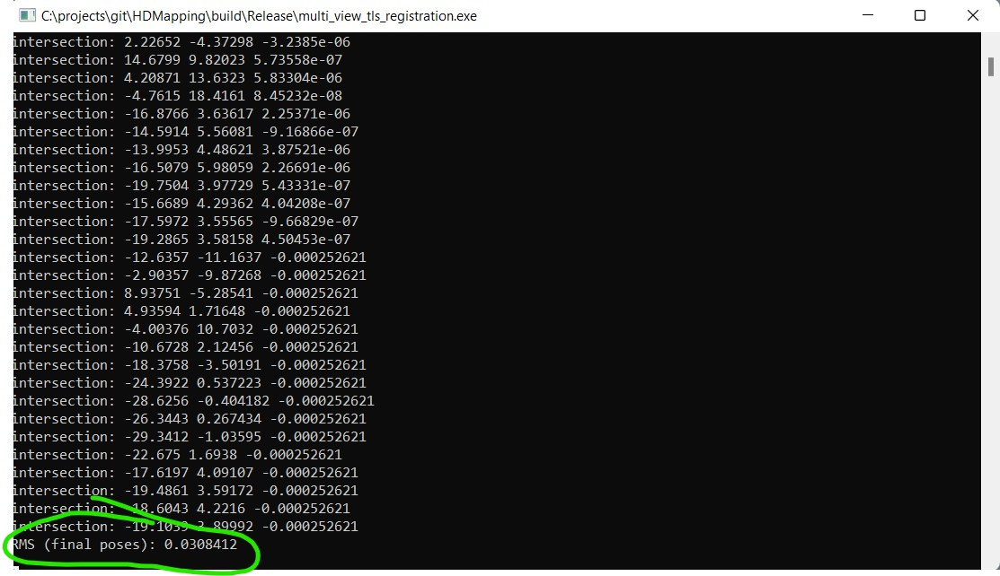

Step 7: Enjoy improved ground truth

[1] Songlin Chen, Liangliang Nan, Renbo Xia, Jibin Zhao, and Peter Wonka. Plade: A plane-based descriptor for point cloud registration with small overlap. 58(4):2530–2540, 2020.

