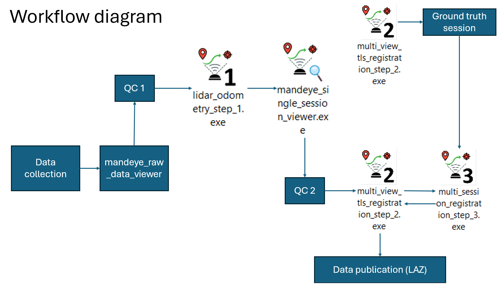

# Open-source (Windows, Linux and macOS), open hardware hand-held/wearable/mountable mobile mapping system for large-scale surveys:
This is open-source software for large-scale 3D mapping using an open-hardware hand-held/wearable/mountable measurement device available at https://github.com/JanuszBedkowski/mandeye_controller. 
We provide an end-to-end mobile mapping framework that does not require any installation, including:

- **HDMapping_LI0**: our implementation of LiDAR Inertial Odometry that outperforms the State of the Art [[movie]](https://youtu.be/UB-Hx7qgey8).
- **HDMapping_Pose_GRAPH_SLAM** to create city-level maps.
- **HDMapping_Georeferencing** (GNSS-RTK, Control Points, Ground Control Points, TLS, ALS).

# PROJECT ONBOARDING VIDEOS - OPENING MEASUREMENT SEASON 2026
- Contact email: januszbedkowski@gmail.com

[](https://youtu.be/ntF8kO8r8MM)
[](https://youtu.be/Is4IvLiTCyw)
[](https://youtu.be/rJST0zhNVwc)

# MANDEYE is action

[](https://youtu.be/7a_o7ACH0-M)
[](https://youtu.be/Bu9kDF5y39s)
[](https://youtu.be/i6Xg_vPuqrY)

Our MANDEYE is designed for freedom in motion. You can also climb and crawl in most challenging scenarios.

# Workflow



To cite benchmark suite please use as follows:
```
@article{BEDKOWSKI2026102822,
title = {MapsHD: A benchmark suite for LiDAR odometry frameworks},
journal = {SoftwareX},
volume = {35},
pages = {102822},
year = {2026},
issn = {2352-7110},
doi = {https://doi.org/10.1016/j.softx.2026.102822},
url = {https://www.sciencedirect.com/science/article/pii/S2352711026003146},
author = {Janusz Bȩdkowski and Michał Pełka and Karol Majek and Marcin Matecki and Adrian Radulescu and Charles Hamesse and Ethan Decleyn and Przemysław Lekston and Tomasz Owerko and Przemysław Kuras and Michał Ciszewski and Jakub Kolecki and Karolina Tomaszkiewicz and Łukasz Ambroziński and Joanna Koszyk and Bartosz Hyla and Karolina Pargieła and Anna Malczewska and Tomasz Lipecki and Artur Adamek and Bartosz Mitka and Klapa Przemysław and Pelagia Gawronek and Martin Mokros and Jozef Výboštok and Juliána Chudá and Michal Skladan and Carlos Cabo and Kim André Anstensen and Craciun Daniel-Marian and Antun Jakopec and Michal Wlasiuk and Kornel Mrozowski and Maksymilian Kulicki and Krzysztof Stereńczak and Oskar Bartosz and Jakub Markiewicz and Sławomir Łapiński and Adam Kostrzewa and Mariana Campos and Machi Zawidzki and Jacek Szklarski and Rami Faraj and Loris Redovniković and Jurica Jagetić and Samer Karam and Răzvan Dumbravă and Milosz Mielcarek and Grzegorz Krok and Michal Laszkowski and Jaroslaw Wajs and Jakub Chudziński},
keywords = {LiDAR odometry, LiDAR-inertial odometry, Benchmarking},
abstract = {This paper describes a software toolbox for LiDAR (Light Detection and Ranging) and LiDAR-Inertial Odometry qualitative and quantitative evaluation. We provide software as https://github.com/MapsHD organization with all necessary information at https://github.com/MapsHD/HDMapping. Our software contributions are a) ground truth data processing tool, b) dockerized state-of-the-art LO and LIO algorithms, c) multi-session data registration to common coordinate system, d) Absolute Pose Error (APE) and Relative Pose Error (RPE) metrics, e) import/export tools for easier 3D data handling and visualizing, e.g., in Cloud Compare software. This software is compatible with ROS1 (Robot Operating System) and ROS2 data formats. We show an example benchmark of LeGO-LOAM, LIO-SAM, FAST-LIO, DLO, VoxelMap, Faster-LIO, KISS-ICP, CT-ICP, SLICT, DLIO, GLIM, iG-LIO, LIO-EKF, I2EKF-LO, GenZ-ICP, RESPLE, odometry_ros_wrapper, Point-LIO, and LOAM-Livox algorithms. For all experiments we provide movies. The contribution of the paper is software-oriented LO/LIO algorithm benchmark suite. The novelty lies in the integration of multiple benchmarking steps into a unified framework, thus overall effort needed for qualitative and quantitative evaluation is reduced.}
}
```

Mobile mapping system: hardware and software are elaborated in the following paper:

```
@article{BEDKOWSKI2024101618,
     title = {Open source, open hardware hand-held mobile mapping system for large scale surveys},
     journal = {SoftwareX},
     volume = {25},
     pages = {101618},
     year = {2024},
     issn = {2352-7110},
     doi = {https://doi.org/10.1016/j.softx.2023.101618},
     url = {https://www.sciencedirect.com/science/article/pii/S235271102300314X},
     author = {Janusz Będkowski},
     keywords = {A mobile mapping, Lidar odometry, Loop closure, Iterative closest point, Data registration, SLAM},
     abstract = {This paper presents open-source software for large-scale 3D mapping using an open-hardware hand-held measurement device. This work is dedicated to educational and research purposes. This software is composed of three components: LIDAR odometry, single-session refinement, and multi-session refinement. Data refinement uses a pose-graph loop closure technique and an Iterative Closest Point algorithm to minimize the error of the edge. The results are 3D point clouds in LAZ data format (compressed LAS - LIDAR Aerial Survey). It was tested in many real-world scenarios/applications: city-level 3D mapping, culture heritage, creating ground truth data for mobile robots, precise forestry, and large-scale indoor 3D mapping. This software can run on Linux and Windows machines, it does not incorporate GPU computing. It is advised to use at least 32 GB of RAM to cope with large data sets. The optimization framework is implemented from scratch using the Eigen library, thus there is no need to install any additional libraries such as Ceres, g2o, GTSAM, manif, Sophus, etc.}
}
```

Terrestrial Laser Scanner data registration is elaborated in following paper:

```
@article{BEDKOWSKI2023113199,
     title = {Benchmark of multi-view Terrestrial Laser Scanning Point Cloud data registration algorithms},
     journal = {Measurement},
     pages = {113199},
     year = {2023},
     issn = {0263-2241},
     doi = {https://doi.org/10.1016/j.measurement.2023.113199},
     url = {https://www.sciencedirect.com/science/article/pii/S0263224123007637},
     author = {Janusz Będkowski},
     keywords = {TLS, Point cloud, Open-source, Multi-view data registration, LiDAR data metrics, Robust loss function, Tait-Bryan angles, Quaternions, Rodrigues’ formula, Lie algebra, Rotation matrix parameterization},
     abstract = {This study addresses multi-view Terrestrial Laser Scanning Point Cloud data registration methods. Multiple rigid point cloud data registration is mandatory for aligning all scans into a common reference frame and it is still considered a challenge looking from a large-scale surveys point of view. The goal of this work is to support the development of cutting-edge registration methods in geoscience and mobile robotics domains. This work evaluates 3 data sets of a total 20 scenes available in the literature. This paper provides a novel open-source framework for multi-view Terrestrial Laser Scanning Point Cloud data registration benchmarks. The goal was to verify experimentally which registration variant can improve the open-source data looking from the quantitative and qualitative points of view. In particular, the following scanners provided measurement data: Z+F TLS Imager 5006i, Z+F TLS Imager 5010C, Leica ScanStation C5, Leica ScanStation C10, Leica P40 and Riegl VZ-400. The benchmark shows an impact of the metric e.g. point to point, point to projection onto a plane, plane to plane, etc..., rotation matrix parameterization (Tait-Bryan, quaternion, Rodrigues) and other implementation variations (e.g. multi-view Normal Distributions Transform, Pose Graph SLAM approach) onto the multi-view data registration accuracy and performance. An open-source project is created and it can be used for improving existing data sets reported in the literature, it is the added value of the presented research. The combination of metrics, rotation matrix parameterization, and optimization algorithms creates hundreds of possible approaches. It is shown that the chosen metric is a dominant factor in data registration. The rotation parameterization and other degrees of freedom of proposed variants are rather negligible compared with the chosen metric. Most of the proposed approaches improve registered reference data provided by other researchers. Only for 2 of 20 scenes it was not possible to provide significant improvement. The largest improvements are evident for large-scale scenes. The project is available and maintained at https://github.com/MapsHD/HDMapping.}
}
```

The **HDMapping** optimization framework is implemented from scratch https://github.com/JanuszBedkowski/observation_equations using the Eigen library, thus there is no need to install any additional libraries such as **Ceres**, **g2o**, **GTSAM**, **manif**, **Sophus**, etc.
More information can be found in:

```
@book{DBLP:series/cir/Bedkowski22,
  author       = {Janusz Bedkowski},
  title        = {Large-Scale Simultaneous Localization and Mapping},
  series       = {Cognitive Intelligence and Robotics},
  publisher    = {Springer},
  year         = {2022},
  url          = {https://doi.org/10.1007/978-981-19-1972-5},
  doi          = {10.1007/978-981-19-1972-5},
  isbn         = {978-981-19-1971-8},
  timestamp    = {Mon, 25 Jul 2022 08:41:19 +0200},
  biburl       = {https://dblp.org/rec/series/cir/Bedkowski22.bib},
  bibsource    = {dblp computer science bibliography, https://dblp.org}
}
```

# Documentation

```Documentation data structure
<documentation>/
├── Applications [[link]](https://github.com/MapsHD/HDMapping/tree/main/documentation/Applications)
├── Benchmarks
├── CompatibleCommunityProjects
├── Hardware
├── InstallationGuide
├── KnowledgeBase
├── Tools
└── VIDEOs
```
