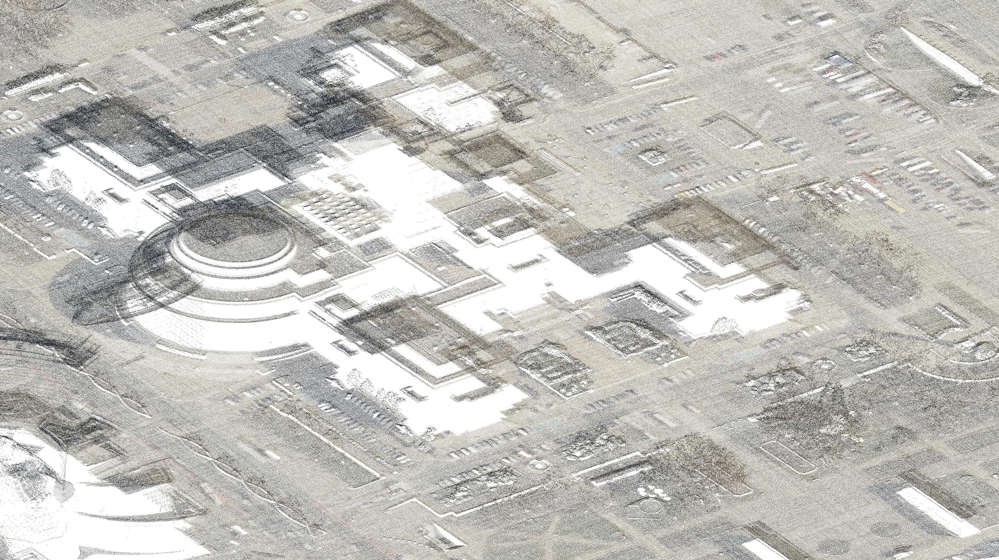

# PROJECT ONBOARDING VIDEOS - OPENING MEASUREMENT SEASON 2026
[](https://youtu.be/ntF8kO8r8MM)
[](https://youtu.be/Is4IvLiTCyw)
[](https://youtu.be/rJST0zhNVwc) 

# Open-source (Windows and Linux), open hardware hand-held/wearable/mountable mobile mapping system for large-scale surveys:
This is open-source software for large-scale 3D mapping using an open-hardware hand-held/wearable/mountable measurement device available at https://github.com/JanuszBedkowski/mandeye_controller. 
We provide an end-to-end mobile mapping framework that does not require any installation, including:
- **HDMapping_LI0**: our implementation of LiDAR Inertial Odometry that outperforms the State of the Art.
- **HDMapping_Pose_GRAPH_SLAM** to create city-level maps.
- **HDMapping_Georeferencing** (GNSS-RTK, Control Points, Ground Control Points, TLS, ALS).

# We start working on automatic loop closure
We provide easy tool that will help You annotating ground truth SLAM loop closures. You mark pair of point clouds that forms edge, then use ICP like pair wise registration to generatie ground truth for AI training.
Annotated ground truth edges for LiDAR pose graph slam are available at [ground truth edges](https://zenodo.org/records/18527593). 
Movie how to use it is available at [prepare training dataset movie](https://youtu.be/LOGpVg1Nc3k).

[](https://youtu.be/tJdNNfBubeM)
[](https://youtu.be/6SNvrZ2ROKg)

# DOWNLOAD SOFTWARE USING THIS LINK -> [v0.97](https://github.com/MapsHD/HDMapping/releases/tag/v0.97)
# DOWNLOAD DEMO FROM THIS LINK -> [DEMO](https://github.com/MapsHD/HDMapping/blob/main/quick_start_demo/quick_start_demo.7z)

If You are looking for end-to-end mobile mapping framework You can start from this project, since we also provide a benchmark for all other approaches: LeGO-LOAM, LOAM, FAST-LIO, LIO-SAM, CT-ICP, DLO, VoxelMap, Faster-LIO, KISS-ICP, SLICT, DLIO, Point-LIO, GLIM, MAD-ICP, iG-LIO, LIO-EKF, I2EKF-LO, GenZ-ICP, RESPLE, 93won/lidar_odometry, KISS-SLAM. We work on integration: mola_lidar_odometry, rko_lio, lio_gvm, sr_lio, Light-LOAM, LIO-SEGMOT, GLIO, floam, A-LOAM, LOG-LIO, LOG-LIO2, VOX-LIO.
**Our goal is to find/develop/discover best end-to-end mobile mapping framework.**

## Quick Start (Ubuntu / Ubuntu 24.04 @ WSL2)

### CMake 4.0.0 or Higher

This project requires **CMake 4.0.0** or higher. If you don't have it installed, you can download it from:

**Official CMake Downloads:**
- **Linux/macOS/Windows:** https://cmake.org/download/
- **GitHub Releases (Linux binaries):** https://github.com/Kitware/CMake/releases/tag/v4.0.0

**Installation on Linux:**
```bash
wget https://github.com/Kitware/CMake/releases/download/v4.0.0/cmake-4.0.0-linux-x86_64.sh
sudo sh cmake-4.0.0-linux-x86_64.sh --skip-license --prefix=/usr/local
cmake --version
```

``` bash
git clone --recursive https://github.com/MapsHD/HDMapping.git
cd HDMapping
./ubuntu-24.04-apt-requirements.sh

# Auto-optimized build (detects your CPU automatically)
cmake -B build -S . -DCMAKE_BUILD_TYPE=Release
cmake --build build --config Release -j
```

# Supported LiDARs

We support LIVOX AVIA, HAP, MID360, Ouster OS0, OS1, OS2, OSDome, SICK multiScan100, HESAI JT16, HESAI JT128, HESAI XT, Robosense AIRY.
HESAI XT requires external IMU. We are going to support more LiDARs ASAP.

More information can be found here:
- The introductory paper is available here: https://www.sciencedirect.com/science/article/pii/S235271102300314X
- Sample data is available at https://github.com/MapsHD/OmniWarsawDataset 
- VIDEO (how to build mobile mapping hardware) https://www.youtube.com/watch?v=BXBbuSJMFEo
- If you are a ROS user, please visit https://github.com/MapsHD/mandeye_to_bag to convert MANDEYE data to ROSBAG
- ROSCON 2024 workshop (sample data sets and more ...): https://michalpelka.github.io/RosCon2024_workshop/
- You can use it also for multi-view Terrestrial Laser Scanner Registration (Faro, Leica, Z+F, Riegl, etc...) https://www.sciencedirect.com/science/article/abs/pii/S0263224123007637
- Info for Windows users: please use the latest release https://github.com/MapsHD/HDMapping/releases 
- Contact email: januszbedkowski@gmail.com

# GNSS with RTK
A portable NTRIP (Networked Transport of RTCM via Internet Protocol) client for M5Stack devices that receives RTK correction data from NTRIP casters and forwards it to u-blox GNSS receivers for high-precision positioning https://github.com/michalpelka/M5NtripClient.

# MANDEYE is action
[](https://youtu.be/7a_o7ACH0-M)
[](https://youtu.be/Bu9kDF5y39s)
[](https://youtu.be/i6Xg_vPuqrY)

Our MANDEYE is designed for freedom in motion. You can also climb and crawl in most challenging scenarios.

# Compatible community projects
- Handheld Setup for Recording with Mid360 Lidar and Camera https://github.com/RomanStadlhuber/livo-handheld 
- Lidar odometry for HDMapping project utilizing KISS-ICP https://github.com/michalpelka/kiss-lidarodometry

# Compatible other SOTA algorithms (benchmark)
Download the dataset from [Bunker DVI Dataset](https://charleshamesse.github.io/bunker-dvi-dataset/)  


We provide HDMapping-LIO: easy to run, easy to test LiDAR Inertial Odometry that is as accurate as FAST-LIO, FASTER-LIO and much more precise.


All following algorithms are generating session compatible with 'multi_view_tls_registration_step_2'
- https://github.com/MapsHD/benchmark-LeGO-LOAM-to-HDMapping (2018, IROS, [[BIB]](https://github.com/MapsHD/HDMapping/blob/main/bib/legoloam2018.bib), [[movie]](https://youtu.be/WpFBXe1zKto))
- https://github.com/MapsHD/benchmark-LOAM-Livox-to-HDMapping (2019, arXiv, [[BIB]](https://github.com/MapsHD/HDMapping/blob/main/bib/loam_livox.bib),
[[movie]](https://youtu.be/MbKHTmUcI2w))
- https://github.com/MapsHD/benchmark-FAST-LIO-to-HDMapping (2020, arXiv, [[BIB]](https://github.com/MapsHD/HDMapping/blob/main/bib/FAST-LIO.bib),
[[movie]](https://youtu.be/ENlaQTtOXEM))
- https://github.com/MapsHD/benchmark-LIO-SAM-to-HDMapping (2020, IROS, [[BIB]](https://github.com/MapsHD/HDMapping/blob/main/bib/LIO-SAM.bib))
- https://github.com/MapsHD/benchmark-CT-ICP-to-HDMapping (2021, arXiv, [[BIB]](https://github.com/MapsHD/HDMapping/blob/main/bib/CT-ICP.bib),
[[movie]](https://youtu.be/swEsJHwtE50))
- https://github.com/MapsHD/benchmark-DLO-to-HDMapping (2022, RA-L, [[BIB]](https://github.com/MapsHD/HDMapping/blob/main/bib/DLO.bib), [[movie]](https://youtu.be/-UH81mNLw8Q))
- https://github.com/MapsHD/benchmark-VoxelMap-to-HDMapping (2022, arXiv, [[BIB]](https://github.com/MapsHD/HDMapping/blob/main/bib/VoxelMap.bib), 
[[movie]](https://youtu.be/oRiuvJRNl-c))
- https://github.com/MapsHD/benchmark-Faster-LIO-to-HDMapping (2022, RA-L, [[BIB]](https://github.com/MapsHD/HDMapping/blob/main/bib/Faster-LIO.bib), [[movie]](https://youtu.be/bV1jgF_m-Zo))
- https://github.com/MapsHD/benchmark-KISS-ICP-to-HDMapping (2023, RA-L, [[BIB]](https://github.com/MapsHD/HDMapping/blob/main/bib/KISS-ICP.bib),
[[movie]](https://youtu.be/GyB8UuQN0Io))
- https://github.com/MapsHD/benchmark-SLICT-to-HDMapping (2023, RA-L, [[BIB]](https://github.com/MapsHD/HDMapping/blob/main/bib/SLICT.bib), 
[[movie]](https://youtu.be/TUaJN7FJOFU))
- https://github.com/MapsHD/benchmark-DLIO-to-HDMapping (2023, ICRA, [[BIB]](https://github.com/MapsHD/HDMapping/blob/main/bib/DLIO.bib), [[movie]](https://youtu.be/xFLqFcoAtk8))
- https://github.com/MapsHD/benchmark-Point-LIO-to-HDMapping (2024, JAIS, [[BIB]](https://github.com/MapsHD/HDMapping/blob/main/bib/Point-LIO.bib),
[[movie]](https://youtu.be/JlD1hDJHcrs))
- https://github.com/MapsHD/benchmark-GLIM-to-HDMapping (2024, arXiv, [[BIB]](https://github.com/MapsHD/HDMapping/blob/main/bib/GLIM.bib),
[[movie]](https://youtu.be/zyZDJECqOG0))
- https://github.com/MapsHD/benchmark-MAD-ICP-to-HDMapping (2024, RA-L, [[BIB]](https://github.com/MapsHD/HDMapping/blob/main/bib/MAD-ICP.bib))
- https://github.com/MapsHD/benchmark-iG-LIO-to-HDMapping (2024, RA-L, [[BIB]](https://github.com/MapsHD/HDMapping/blob/main/bib/iG-LIO.bib), 
[[movie]](https://youtu.be/KlZf7nHeVmI))
- https://github.com/MapsHD/benchmark-LIO-EKF-to-HDMapping (2024, ICRA, [[BIB]](https://github.com/MapsHD/HDMapping/blob/main/bib/LIO-EKF.bib),
[[movie]](https://youtu.be/R4Cn1LJ4U_E))
- https://github.com/MapsHD/benchmark-I2EKF-LO-to-HDMapping (2024, arXiv, [[BIB]](https://github.com/MapsHD/HDMapping/blob/main/bib/I2EKF-LO.bib),
[[movie]](https://youtu.be/B2358Gn62Ho))  
- https://github.com/MapsHD/benchmark-GenZ-ICP-to-HDMapping (2025, RA-L, [[BIB]](https://github.com/MapsHD/HDMapping/blob/main/bib/GenZ-ICP.bib))
- https://github.com/MapsHD/benchmark-RESPLE-to-HDMapping (2025, RA-L, [[BIB]](https://github.com/MapsHD/HDMapping/blob/main/bib/RESPLE.bib))
- https://github.com/MapsHD/benchmark-lidar_odometry_ros_wrapper-to-HDMapping (2025, RA-L, [[BIB]](https://github.com/MapsHD/HDMapping/blob/main/bib/lidar_odometry_ros_wrapper.bib))


ToDo
- https://robotics-upo.github.io/D-LIO/
- https://github.com/MapsHD/benchmark-KISS-SLAM-to-HDMapping (2025, IROS, [[BIB]](https://github.com/MapsHD/HDMapping/blob/main/bib/kiss-slam.bib)) (not solved issue https://github.com/kpmrozowski/KISS-SLAM-to-HDMapping/issues/1)
- https://github.com/MOLAorg/mola_lidar_odometry (2025, IJRR, [[BIB]](https://github.com/MapsHD/HDMapping/blob/main/bib/mola-lidar-odometry.bib)) (not solved issue: https://github.com/MOLAorg/mola_lidar_odometry/issues/37)
- https://github.com/Whan000/MOLA-SLAM (instruction to https://github.com/MOLAorg/mola_lidar_odometry)
- https://github.com/MapsHD/rko_lio (2025, arXiv, [[BIB]](https://github.com/MapsHD/HDMapping/blob/main/bib/RKO-LIO.bib)) (not solved issue: https://github.com/marcinmatecki/rko-lio-to-HDMapping/issues/1)
- https://github.com/clegenti/2fast2lamaa (2025, arXiv, [[BIB]](https://github.com/MapsHD/HDMapping/blob/main/bib/2FAST-2LAMAA.bib))
- https://github.com/lian-yue0515/MM-LINS (2025, TIV, [[BIB]](https://github.com/MapsHD/HDMapping/blob/main/bib/MM-LINS.bib))
- https://github.com/Liansheng-Wang/Super-LIO (2025, arXiv, [[BIB]](https://github.com/MapsHD/HDMapping/blob/main/bib/Super-LIO.bib))
- VOX-LIO https://www.mdpi.com/2072-4292/17/13/2214 (2025, MDPI Remote Sensing, [[BIB]](https://github.com/MapsHD/HDMapping/blob/main/bib/VOX-LIO.bib), no code)
- SS-LIO: Robust Tightly Coupled Solid-State LiDAR–Inertial Odometry for Indoor Degraded Environments (2025, MDPI electronics, [[BIB]](https://github.com/MapsHD/HDMapping/blob/main/bib/SS-LIO.bib), no code)
- https://github.com/Ji1Xingyu/lio_gvm (2024, RA-L, [[BIB]](https://github.com/MapsHD/HDMapping/blob/main/bib/LIO-GVM.bib)) (not solved issues: https://github.com/Ji1Xingyu/lio_gvm/issues/13, https://github.com/Ji1Xingyu/lio_gvm/issues/12, https://github.com/Ji1Xingyu/lio_gvm/issues/7)
- https://github.com/ZikangYuan/sr_lio (2024, IROS, [[BIB]](https://github.com/MapsHD/HDMapping/blob/main/bib/sr-lio.bib))
- https://github.com/BrenYi/Light-LOAM (2024, RA-L, [[BIB]](https://github.com/MapsHD/HDMapping/blob/main/bib/Light-LOAM.bib))
- https://github.com/tiev-tongji/LOG-LIO2 (2024, arXiv, [[BIB]](https://github.com/MapsHD/HDMapping/blob/main/bib/LOG-LIO2.bib))
- https://github.com/dhchung/nv_liom (2024, RA-L, [[BIB]](https://github.com/MapsHD/HDMapping/blob/main/bib/NV-LIOM.bib))
- https://github.com/hku-mars/Voxel-SLAM (2024, arXiv, [[BIB]](https://github.com/MapsHD/HDMapping/blob/main/bib/Voxel-SLAM.bib), 2nd place ICRA HILTI 2023 SLAM Challenge, 1st place ICCV 2023 SLAM Challenge) 
- https://github.com/StephLin/LIO-SEGMOT (2023, ICRA, [[BIB]](https://github.com/MapsHD/HDMapping/blob/main/bib/LIO-SEGMOT.bib))
- https://github.com/XikunLiu-huskit/GLIO (2023, TIV, [[BIB]](https://github.com/MapsHD/HDMapping/blob/main/bib/GLIO.bib))
- https://github.com/tiev-tongji/LOG-LIO (2023, RA-L, [[BIB]](https://github.com/MapsHD/HDMapping/blob/main/bib/LOG-LIO.bib))
- https://github.com/wh200720041/floam (2021, IROS, [[BIB]](https://github.com/MapsHD/HDMapping/blob/main/bib/F-LOAM.bib))
- https://github.com/HKUST-Aerial-Robotics/A-LOAM (2019, no publication)
- https://neufs-ma.github.io/M3DSS/index.html (benchmark, dataset)
- https://github.com/MapsHD/benchmark-LiDAR-IMU-Init-to-HDMapping (2022) (extrinsic calibration)
- Fast and Robust LiDAR-Inertial Odometry by Tightly-Coupled Iterated Kalman Smoother and Robocentric Voxels
- https://www.sciencedirect.com/science/article/abs/pii/S1566253525002052
- https://github.com/SlamCabbage/Optimized-SC-F-LOAM
- https://github.com/gisbi-kim/SC-LeGO-LOAM
- https://github.com/ChaoqinRobotics/LINS---LiDAR-inertial-SLAM

# Knowledge base (accuracy, precision, benchmarks, comparison to other mobile mapping systems, etc.) 
- Janusz Będkowski et al., "A Novel Approach to Global Positioning System Accuracy Assessment, Verified on LiDAR Alignment of One Million Kilometers at a Continent Scale, as a Foundation for Autonomous DRIVING Safety Analysis." (2021, MDPI-Sensors, [[PDF]](https://www.mdpi.com/1424-8220/21/17/5691), [[BIB]](https://github.com/MapsHD/HDMapping/blob/main/bib/sensors-v21-i17_20260104.bib))
- Loris Redovniković, Antun Jakopec, Janusz Będkowski, Jurica Jagetić, "The affordable DIY Mandeye LiDAR system for surveying caves, and how to convert 3D clouds into traditional cave ground plans and extended profiles." (2024, IJS, [[PDF]](https://digitalcommons.usf.edu/cgi/viewcontent.cgi?article=2535&context=ijs), [[BIB]](https://github.com/MapsHD/HDMapping/blob/main/bib/ijs.bib)) 
- Bartosz Mitka, Klapa Przemysław and Gawronek Pelagia, "Laboratory Tests of Metrological Characteristics of a Non-Repetitive Low-Cost Mobile Handheld Laser Scanner." (2024, MDPI-Sensors, [[PDF]](https://www.mdpi.com/1424-8220/24/18/6010), [[BIB]](https://github.com/MapsHD/HDMapping/blob/main/bib/sensors-v24-i18_20260104.bib))  
- Elalailyi, Ahmad, et al., "Pose Graph Data Fusion for Visual-and LiDAR-based Low-Cost Portable Mapping Systems." (2024, LowCost 3D, [[PDF]](https://isprs-archives.copernicus.org/articles/XLVIII-2-W8-2024/147/2024/isprs-archives-XLVIII-2-W8-2024-147-2024.pdf), [[BIB]](https://github.com/MapsHD/HDMapping/blob/main/bib/isprs-archives-XLVIII-2-W8-2024-147-2024.bib))
- Balestra Mattia, et al., "Advancing forest inventory: a comparative study of low-cost MLS lidar device with professional laser scanners." (2024, LowCost 3D, [[PDF]](https://isprs-archives.copernicus.org/articles/XLVIII-2-W8-2024/9/2024/isprs-archives-XLVIII-2-W8-2024-9-2024.pdf), [[BIB]](https://github.com/MapsHD/HDMapping/blob/main/bib/isprs-archives-XLVIII-2-W8-2024-9-2024.bib)) 
- Janusz Będkowski et al., "Novel (re-configurable, wearable, lightweight, ergonomic) low cost 3D mobile mapping system not only for extreme mapping applications." (2024, LowCost 3D, [[PDF]](https://isprs-archives.copernicus.org/articles/XLVIII-2-W8-2024/25/2024/isprs-archives-XLVIII-2-W8-2024-25-2024.pdf), [[BIB]](https://github.com/MapsHD/HDMapping/blob/main/bib/isprs-archives-XLVIII-2-W8-2024-25-2024.bib))
- Biloš Josip, "3D mobilno kartiranje pomoću MandEye sustava prikupljanja i obrade prostornih podataka" (2024, [[PDF]](https://repozitorij.geof.unizg.hr/islandora/object/geof%3A142/datastream/PDF/view))
- Janusz Będkowski, "Benchmark of multi-view Terrestrial Laser Scanning Point Cloud data registration algorithms." (2023, Elsevier-Measurement, [[PDF]](https://www.sciencedirect.com/science/article/abs/pii/S0263224123007637), [[BIB]](https://github.com/MapsHD/HDMapping/blob/main/bib/S0263224123007637.bib))
- Janusz Będkowski, Affordable geo-localisation of humanitarian demining tools (mountable on K9, robot, hand-held device, etc.) in GNSS-denied environment, (2024, HCR-CTRO [[PDF]](https://www.ctro.hr/userfiles/files/Affordable%20geo-localisation%20in%20GNSS%20denied%20environment%2C%20Janusz%20B%C4%99dkowski.pdf))
- Aguilar Fernando J., et al., "Preliminary Results of a Low-Cost Portable Terrestrial LiDAR Based on ICP-SLAM Algorithms. Application to Automatic Forest Digital Inventory" (2024, EMCEI, [[PDF]](https://www.ibles.pl/wp-content/uploads/2024/06/Torana-Arya.pdf))
- Janusz Będkowski, "Novel wearable mobile mapping system for Forensic and Security, mountable on trained dogs and humans" (2025, TechRxiv, [[PDF]](https://www.techrxiv.org/users/915148/articles/1288112-novel-wearable-mobile-mapping-system-for-forensic-and-security-mountable-on-trained-dog-and-human), [[BIB]](https://github.com/MapsHD/HDMapping/blob/main/bib/citation.bib))
- Janusz Będkowski et al., "Method for spherical camera to 3D LiDAR calibration and synchronization with example on Insta360 X4 and LiVOX MID 360" (2025, EuroCOW, [[PDF]](https://isprs-archives.copernicus.org/articles/XLVIII-1-W4-2025/13/2025/isprs-archives-XLVIII-1-W4-2025-13-2025.pdf), [[BIB]](https://github.com/MapsHD/HDMapping/blob/main/bib/isprs-archives-XLVIII-1-W4-2025-13-2025.bib))
- Janusz Będkowski et al., "Affordable air-ground mobile mapping system for precise forestry applications" (2025, EuroCOW, [[PDF]](https://isprs-archives.copernicus.org/articles/XLVIII-1-W4-2025/5/2025/isprs-archives-XLVIII-1-W4-2025-5-2025.pdf), [[BIB]](https://github.com/MapsHD/HDMapping/blob/main/bib/isprs-archives-XLVIII-1-W4-2025-5-2025.bib))
- Jozef Výbošťok et al., "An Open and Low-Cost Terrestrial Laser Scanner Prototype: Delivering Reliable Accuracy for Forest Practice on a Budget" (2025, SSRN, [[PDF]](https://papers.ssrn.com/sol3/papers.cfm?abstract_id=5386703))
- Janusz Będkowski et al., "Acquisition and digitization of large scale heritage scenes with open source project https://github.com/MapsHD/HDMapping" (2025, DIGITAL HERITAGE, [[PDF]](https://diglib.eg.org/items/5ce9eb81-e04f-4e58-a0c8-4e66c4ae6960), [[BIB]](https://github.com/MapsHD/HDMapping/blob/main/bib/dh.bib))
- Samuele Facenda et al. 3D Robotics and LMM for Vineyard Inspection [[PDF]](https://isprs-archives.copernicus.org/articles/XLVIII-G-2025/431/2025/isprs-archives-XLVIII-G-2025-431-2025.pdf)
- Jozef Výbošťok et al.. "An Open and Novel Low-Cost Terrestrial Laser Scanner Prototype for Forest Monitoring" (2025, MDPI-Sensors, [[PDF]](https://www.mdpi.com/1424-8220/26/1/63), [[BIB]](https://github.com/MapsHD/HDMapping/blob/main/bib/sensors-v26-i01_20260104.bib))
- Janusz Będkowski et al., "MapsHD: A Benchmark Suite for LiDAR Odometry Frameworks" (2025, SSRN, [[PDF]](https://papers.ssrn.com/sol3/papers.cfm?abstract_id=5986422))
- Janusz Będkowski et al., "The benchmark of LiDAR odometry algorithms utilised for a low-cost mobile mapping system" (2025, GEOBENCH, [[PDF]](https://isprs-archives.copernicus.org/articles/XLVIII-1-W6-2025/25/2025/isprs-archives-XLVIII-1-W6-2025-25-2025.pdf) [[BIB]](https://github.com/MapsHD/HDMapping/blob/main/bib/isprs-archives-XLVIII-1-W6-2025-25-2025.bib))
- Andro Kokeza et al. "Comparative Performance of Handheld Personal Laser Scanning Instruments and Operator Experience in Forest Inventory of Even-Aged European Beech Stand"(2026, MDPI-Forests, [[PDF]](https://www.mdpi.com/1999-4907/17/2/216) [[BIB]](https://github.com/MapsHD/HDMapping/blob/main/bib/forests-v17-i02_20260213.bib))

# To cite this work please use as follows:
Mobile mapping system: hardware and software are elaborated in the following paper:
```
@article{BEDKOWSKI2024101618,
     title = {Open source, open hardware hand-held mobile mapping system for large scale surveys},
     journal = {SoftwareX},
     volume = {25},
     pages = {101618},
     year = {2024},
     issn = {2352-7110},
     doi = {https://doi.org/10.1016/j.softx.2023.101618},
     url = {https://www.sciencedirect.com/science/article/pii/S235271102300314X},
     author = {Janusz Będkowski},
     keywords = {A mobile mapping, Lidar odometry, Loop closure, Iterative closest point, Data registration, SLAM},
     abstract = {This paper presents open-source software for large-scale 3D mapping using an open-hardware hand-held measurement device. This work is dedicated to educational and research purposes. This software is composed of three components: LIDAR odometry, single-session refinement, and multi-session refinement. Data refinement uses a pose-graph loop closure technique and an Iterative Closest Point algorithm to minimize the error of the edge. The results are 3D point clouds in LAZ data format (compressed LAS - LIDAR Aerial Survey). It was tested in many real-world scenarios/applications: city-level 3D mapping, culture heritage, creating ground truth data for mobile robots, precise forestry, and large-scale indoor 3D mapping. This software can run on Linux and Windows machines, it does not incorporate GPU computing. It is advised to use at least 32 GB of RAM to cope with large data sets. The optimization framework is implemented from scratch using the Eigen library, thus there is no need to install any additional libraries such as Ceres, g2o, GTSAM, manif, Sophus, etc.}
}
```

Terrestrial Laser Scanner data registration is elaborated in following paper:
```
@article{BEDKOWSKI2023113199,
     title = {Benchmark of multi-view Terrestrial Laser Scanning Point Cloud data registration algorithms},
     journal = {Measurement},
     pages = {113199},
     year = {2023},
     issn = {0263-2241},
     doi = {https://doi.org/10.1016/j.measurement.2023.113199},
     url = {https://www.sciencedirect.com/science/article/pii/S0263224123007637},
     author = {Janusz Będkowski},
     keywords = {TLS, Point cloud, Open-source, Multi-view data registration, LiDAR data metrics, Robust loss function, Tait-Bryan angles, Quaternions, Rodrigues’ formula, Lie algebra, Rotation matrix parameterization},
     abstract = {This study addresses multi-view Terrestrial Laser Scanning Point Cloud data registration methods. Multiple rigid point cloud data registration is mandatory for aligning all scans into a common reference frame and it is still considered a challenge looking from a large-scale surveys point of view. The goal of this work is to support the development of cutting-edge registration methods in geoscience and mobile robotics domains. This work evaluates 3 data sets of a total 20 scenes available in the literature. This paper provides a novel open-source framework for multi-view Terrestrial Laser Scanning Point Cloud data registration benchmarks. The goal was to verify experimentally which registration variant can improve the open-source data looking from the quantitative and qualitative points of view. In particular, the following scanners provided measurement data: Z+F TLS Imager 5006i, Z+F TLS Imager 5010C, Leica ScanStation C5, Leica ScanStation C10, Leica P40 and Riegl VZ-400. The benchmark shows an impact of the metric e.g. point to point, point to projection onto a plane, plane to plane, etc..., rotation matrix parameterization (Tait-Bryan, quaternion, Rodrigues) and other implementation variations (e.g. multi-view Normal Distributions Transform, Pose Graph SLAM approach) onto the multi-view data registration accuracy and performance. An open-source project is created and it can be used for improving existing data sets reported in the literature, it is the added value of the presented research. The combination of metrics, rotation matrix parameterization, and optimization algorithms creates hundreds of possible approaches. It is shown that the chosen metric is a dominant factor in data registration. The rotation parameterization and other degrees of freedom of proposed variants are rather negligible compared with the chosen metric. Most of the proposed approaches improve registered reference data provided by other researchers. Only for 2 of 20 scenes it was not possible to provide significant improvement. The largest improvements are evident for large-scale scenes. The project is available and maintained at https://github.com/MapsHD/HDMapping.}
}
```

The **HDMapping** optimization framework is implemented from scratch https://github.com/JanuszBedkowski/observation_equations using the Eigen library, thus there is no need to install any additional libraries such as **Ceres**, **g2o**, **GTSAM**, **manif**, **Sophus**, etc. 
More information can be found in:

```
@book{DBLP:series/cir/Bedkowski22,
  author       = {Janusz Bedkowski},
  title        = {Large-Scale Simultaneous Localization and Mapping},
  series       = {Cognitive Intelligence and Robotics},
  publisher    = {Springer},
  year         = {2022},
  url          = {https://doi.org/10.1007/978-981-19-1972-5},
  doi          = {10.1007/978-981-19-1972-5},
  isbn         = {978-981-19-1971-8},
  timestamp    = {Mon, 25 Jul 2022 08:41:19 +0200},
  biburl       = {https://dblp.org/rec/series/cir/Bedkowski22.bib},
  bibsource    = {dblp computer science bibliography, https://dblp.org}
}
```

# 0.94 VIDEOs

[](https://youtu.be/k6nysHveoKU)


# Obsolete VIDEOs
Where to find, how to download HDMAPPING software and manual

[](https://youtu.be/dHCOAeto9-M)

Air ground survey 

[](https://youtu.be/_nvq2un_lFc)

Air ground survey result 

[](https://youtu.be/InqpiFrPizg)

Data recorded with Mandeye, online data registration with FAST-LIO.

[](https://youtu.be/u8siB0KLFLc)

How to build Mandeye DEV

[](https://youtu.be/BXBbuSJMFEo)

------------------------------------------

Instruction for precise forestry

1. Fast and fully automatic calculations in a single step

[](https://youtu.be/08E41CPyyj4)

2. hdmapping precise forestry intro

[](https://youtu.be/W2ZHNOdZsq4)

3. hdmapping percise forestry raw data inspection

[](https://youtu.be/WRmW2hi1Cug)

4. hdmapping percise forestry lidar odometry STEP1

[](https://youtu.be/laPuPJRoj5U)

5. hdmapping precise forestry session inspection

[](https://youtu.be/rmLXZh7SQTs)

6. hdmapping precise forestry session inspection

[](https://youtu.be/Biz_OA8x1Ek)

------------------------------------------

Nuclear Power Plant inspection PART 1

[](https://youtu.be/bpXQYZkH8Sc)

Nuclear Power Plant inspection PART 2 

[](https://youtu.be/fJcuGw1RLO0)

------------------------------------------

Cave surveys (climbing, crawling in caves with MANDEYE-MR)

[](https://youtu.be/4iq69c76eG8)


------------------------------------------

Multilevel building: example of using new functionality in v0.75 - intersection 

[](https://youtu.be/XYIHKyaxQzo)


------------------------------------------

MANDEYE Mission Recorder calibration

[](https://youtu.be/V9L0a6aqsJ8)

------------------------------------------

MANDEYE georeferencing to GPS (NMEA data stream)

[](https://youtu.be/FOWPGCgOKI4)

Removing GPS inconsistency after MANDEYE georeferencing to GPS (NMEA data stream)

[](https://youtu.be/gcUV22D4YrY)


MANDEYE georeferencing to GCPs (ground control points)

[](https://youtu.be/iLlU7xzYDe0)

MANDEYE georeferencing to CPs (control points)

[](https://youtu.be/ogeAjzJvLeY)

------------------------------------------

Manual coloring

[](https://youtu.be/EUbAaJp-XmY)

------------------------------------------

# Compatible commercial products
[](https://youtu.be/EBUxUBWKIco)

------------------------------------------

# Building commands

## Requirements


**Installation on Windows:**
- Download the installer from https://cmake.org/download/
- Run the installer and follow the instructions
- Ensure CMake is added to your system PATH

### clang-format

**Instalation on Linux:**
``` bash
sudo apt install clang-format
```

**Installation on Windows**

1. Go to offical llvm-project GitHub [releases page](https://github.com/llvm/llvm-project/releases)
2. Download Windows x64 installer (for example version [21.1.8](https://github.com/llvm/llvm-project/releases/download/llvmorg-21.1.8/LLVM-21.1.8-win64.exe)) - browser might flag exe file malware in that case mark it as "Keep it"
3. Run installer exe
4. In installation program mark "Add LLVM to the system PATH for all users" or "Add LLVM to the system PATH for all current user"
5. Restart any terminal or IDE that you want to use clang-format in so it reloads paths from ENV

**Verification**

To verify that clang-format is installed run:
Verify installation by running:
``` bash
clang-format --version
```

**Formating codebase**

In order to format code base run:
``` bash
python3 run_clang_fromat.py
```

*Note that PRs without formatting might be rejected from merging*


## Quick Start (Windows)
```bash
git clone --recursive https://github.com/MapsHD/HDMapping.git
cd HDMapping

# Auto-optimized build (detects your CPU automatically)
cmake  -B build -S . -DCMAKE_BUILD_TYPE=Release
cmake --build build --config Release
```

## WSL2 GUI
On WSL2 to enable file dialogs in GUI applications you need to install one of the packages used by portable-file-dialogs listed [here](https://github.com/samhocevar/portable-file-dialogs/blob/c12ea8c9a727f5320a2b4570aee863bbede2a204/portable-file-dialogs.h#L539C1-L542C57).

For example on WSL2 Ubuntu-24.04 following package is required to run GUI applications:

``` bash
sudo apt install zenity
```

# Building Debian package.

The standard build contains all necessary libraries compiled with project. 
This approach allows smooth build on Windows platform and guarantee predictable experience.
If you want to build Debian package, you can depends on system-provided libraries:
Before build install 3rd party libraries:
```
sudo apt-get install freeglut3-dev libeigen3-dev liblaszip-dev libopencv-dev
```
Next build Debian package:
```
cmake .. -DBUILD_WITH_BUNDLED_FREEGLUT=0 -DBUILD_WITH_BUNDLED_EIGEN=0 -DBUILD_WITH_BUNDLED_LIBLASZIP=0 -DCMAKE_BUILD_TYPE=Release 
make -j16
make package
```
To install package :
```
sudo dpkg -i hd_mapping-0.*.*-Linux.deb 
```


Mobile mapping systems is based on LiVOX MID360 - laser scanner with non repetetive scanning pattern.
Specification is available at https://www.livoxtech.com/mid-360/specs. Important parameters:
- weight: less than 1kg,
- battery life: up to 5 hours,
- suggested speed during data acquisition: walking speed (4km/h),
- LiDAR type: Livox MID360,
- LiDAR non-repetitive scanning pattern,
- LiDAR range 40m @ 10\% reflectivity, 70 m @ 80\% reflectivity,
- Range Precision (1 $\sigma$): up to 2cm (@ 10m),
- Integrated IMU (Inertial Measurement Unit).

# Possible applications:
- culture heritage
- environmental management
- geology
- urban search and rescue
- urban mapping
- ground truth for AGV (Automated Guided Vehicle)
- mobile robot navigation
- precision forestry
- agricultural robotics
- underground mining
- education
- entertainment
- forensics
- critical infrastructure inspection
- space exploration
- protection systems
- digital twin content generation 
- automation in construction
- etc...


City level survey (perspective view).

City level survey (top view).


3D data from aerial LiDAR mapping. 

Aerial LiDAR fused with ground MANDEYE data (fixed issue with missing elevations).


Construction site.

Construction site augmented with MANDEYE 3D data.

Construction progress monitoring, scale blue - smallest changes, red - largest changes.

