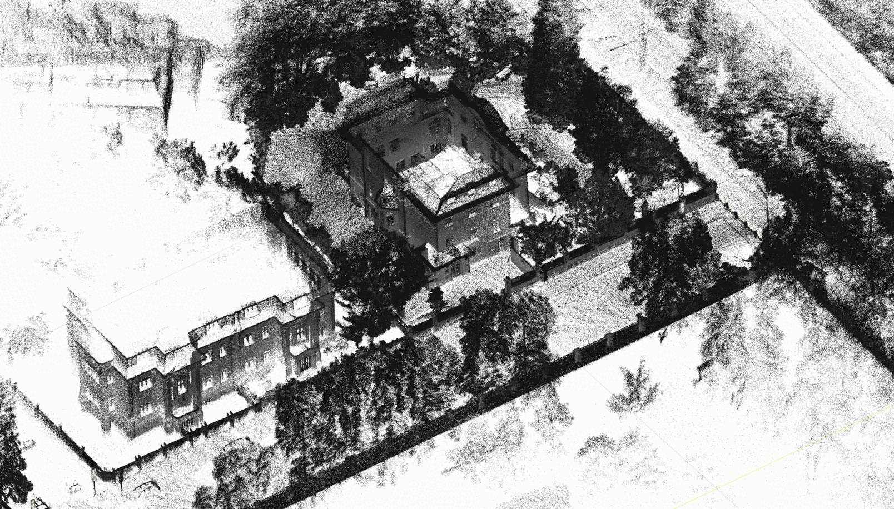
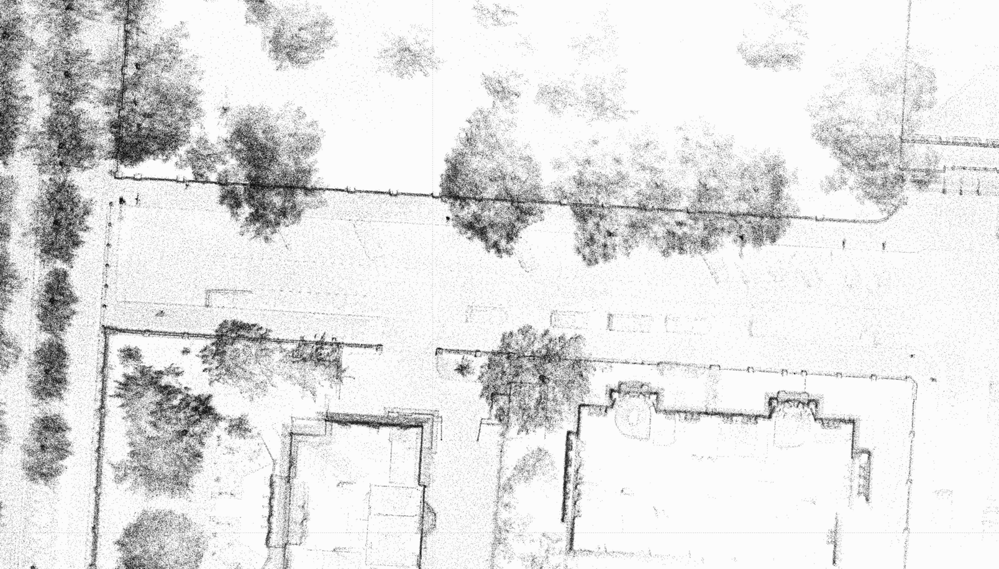
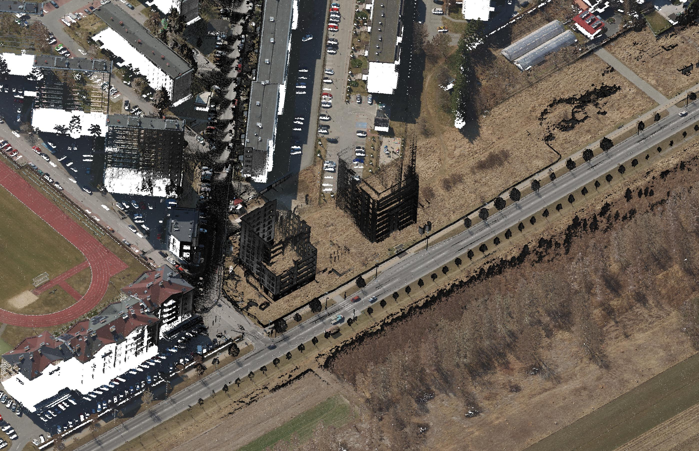
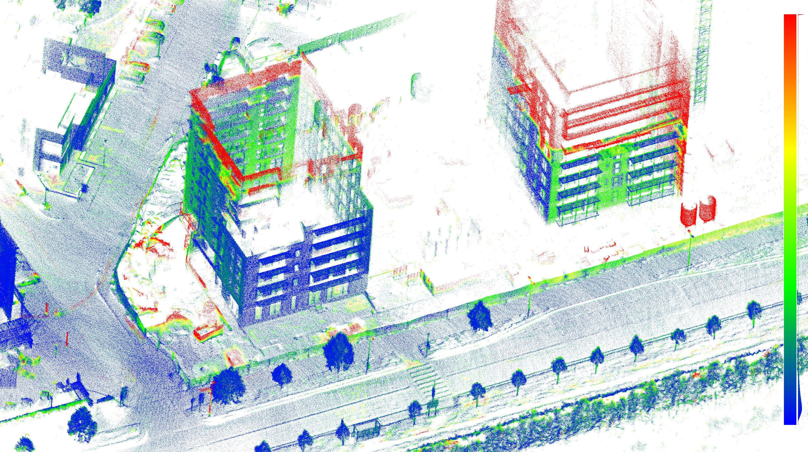

# Possible applications:
- caving
- speleology
- surveying
- culture heritage
- environmental management
- geology
- urban search and rescue
- urban mapping
- ground truth for AGV (Automated Guided Vehicle)
- mobile robot navigation
- precision forestry
- agricultural robotics
- underground mining
- education
- entertainment
- forensics
- critical infrastructure inspection
- space exploration
- protection systems
- digital twin content generation
- automation in construction
- etc...

City level survey (perspective view).

City level survey (top view).

3D data from aerial LiDAR mapping.

Aerial LiDAR fused with ground MANDEYE data (fixed issue with missing elevations).

Construction site.

Construction site augmented with MANDEYE 3D data.

Construction progress monitoring, scale blue - smallest changes, red - largest changes.
