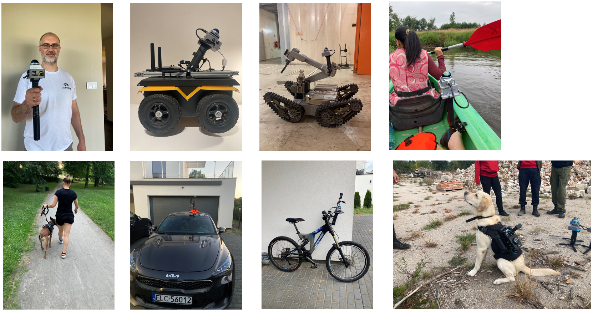

# Supported LiDARs

We support LIVOX AVIA, HAP, MID360, Ouster OS0, OS1, OS2, OSDome, SICK multiScan100, HESAI JT16, HESAI JT128, HESAI XT, Robosense AIRY.
HESAI XT requires external IMU. We are going to support more LiDARs ASAP.

More information can be found here:

- The introductory paper is available here: https://www.sciencedirect.com/science/article/pii/S235271102300314X
- Sample data is available at https://github.com/MapsHD/OmniWarsawDataset
- VIDEO (how to build mobile mapping hardware) https://www.youtube.com/watch?v=BXBbuSJMFEo
- If you are a ROS user, please visit https://github.com/MapsHD/mandeye_to_bag to convert MANDEYE data to ROSBAG
- ROS2 wrapper for HDMapping LiDAR Inertial Odometry (HDMapping-LIO) https://github.com/MapsHD/HDMapping-LIO
- ROSCON 2024 workshop (sample data sets and more ...): https://michalpelka.github.io/RosCon2024_workshop/
- You can use it also for multi-view Terrestrial Laser Scanner Registration (Faro, Leica, Z+F, Riegl, etc...) https://www.sciencedirect.com/science/article/abs/pii/S0263224123007637
- Info for Windows users: please use the latest release https://github.com/MapsHD/HDMapping/releases
- Contact email: januszbedkowski@gmail.com

Mobile mapping systems is based on LiVOX MID360 - laser scanner with non repetetive scanning pattern.
Specification is available at https://www.livoxtech.com/mid-360/specs. Important parameters:

- weight: less than 1kg,
- battery life: up to 5 hours,
- suggested speed during data acquisition: walking speed (4km/h),
- LiDAR type: Livox MID360,
- LiDAR non-repetitive scanning pattern,
- LiDAR range 40m @ 10\% reflectivity, 70 m @ 80\% reflectivity,
- Range Precision (1 $\sigma$): up to 2cm (@ 10m),
- Integrated IMU (Inertial Measurement Unit).